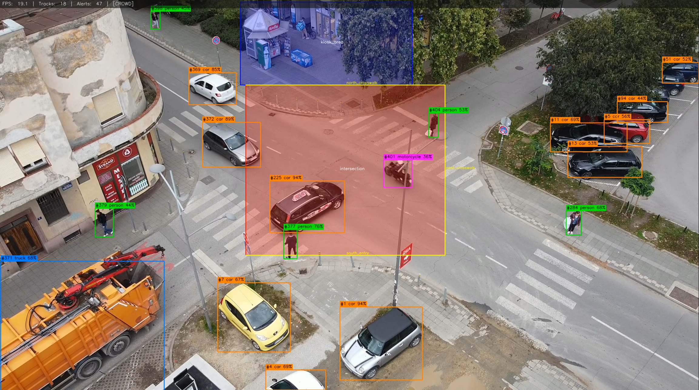

# Real-Time Multi-Target Surveillance Pipeline

A modular, config-driven computer vision pipeline for persistent object detection, tracking, and behavioral analytics on fixed-camera video feeds. Built with YOLOv8 and ByteTrack.

[](https://www.python.org/)
[](https://github.com/ultralytics/ultralytics)
[](LICENSE)

---

## Demo

> 📹 **[Watch full annotated output video →](https://youtu.be/OL1ryiAOxuw)**



The pipeline processed a 1m50s aerial intersection scene and logged **51 structured events** including zone crossings, loitering detections, and crowd threshold alerts — all with persistent track IDs and timestamps.

---

## What It Does

Ingests a video source (file or stream), runs per-frame detection and tracking, and evaluates three behavioral analytics in real time:

| Analytic                | Description                                                                                                                                                                      |
| ----------------------- | -------------------------------------------------------------------------------------------------------------------------------------------------------------------------------- |
| **Loitering Detection** | Fires when a tracked object's centroid remains inside a named zone polygon beyond a configurable time threshold. Zone fill color shifts blue → red proportionally to dwell time. |
| **Zone Crossing**       | Detects when a track's trajectory intersects a named virtual tripwire line. Records crossing direction (AB / BA) and timestamp.                                                  |
| **Crowd Threshold**     | Fires when active track count exceeds a configured limit. Hysteresis band prevents alert flicker on the boundary.                                                                |

Every triggered event is written to a timestamped JSON log alongside an annotated output video.

---

## Architecture

```
video frame
    → Detector       YOLOv8 inference (every N frames, configurable)
    → TrackManager   ByteTrack — assigns and maintains persistent IDs
    → Analytics      Loitering / ZoneCrossing / CrowdThreshold (parallel)
    → Annotator      Draws boxes, zones, HUD, alert banners onto frame
    → IO Layer       VideoWriter (annotated .mp4) + EventLogger (.json)
```

```
surveillance_pipeline/
├── config.py              Pydantic schema + YAML loader
├── detector.py            YOLOv8 wrapper (inference only, no side effects)
├── tracker.py             ByteTrack + persistent Track state (centroid history, age)
├── pipeline.py            Main loop orchestrator
├── analytics/
│   ├── base.py            BaseAnalytic ABC + AlertEvent dataclass
│   ├── loitering.py       Polygon dwell timer with per-episode suppression
│   ├── zone_crossing.py   Segment intersection + direction classification
│   └── crowd_threshold.py Hysteresis-gated count threshold
├── io/
│   ├── video_source.py    Frame iterator with FPS/size metadata
│   ├── video_writer.py    cv2.VideoWriter context manager
│   └── event_logger.py    In-memory accumulator → timestamped JSON
└── rendering/
    └── annotator.py       All OpenCV draw calls isolated here
```

Detection and tracking are intentionally decoupled — `Detector` runs pure inference and returns a list of `Detection` objects; `TrackManager` owns all ByteTrack state. This means the tracker can be swapped (e.g. DeepSORT, StrongSORT) without touching detection or analytics code.

---

## Quickstart

**Requirements:** Python 3.10+, a CUDA-capable GPU is optional but recommended.

```bash
git clone https://github.com/btwest/CV-Suite-App.git
cd CV-Suite-App/surveillance-pipeline

python -m venv venv && source venv/bin/activate
pip install -r requirements.txt
```

Place your input video at `assets/sample_scene.mp4`, then:

```bash
python run.py
```

YOLOv8n weights (~6 MB) download automatically on first run.

---

## Usage

```bash
# Run with default config
python run.py

# Override input video and output directory
python run.py --input path/to/video.mp4 --output-dir results/

# Tune thresholds without editing YAML
python run.py --loitering-threshold 10 --crowd-threshold 12

# Headless (no display window) — useful for servers
python run.py --no-display

# Point at a custom config file
python run.py --config config/my_scene.yaml
```

### Full CLI Reference

| Flag                    | Default               | Description                          |
| ----------------------- | --------------------- | ------------------------------------ |
| `--config`              | `config/default.yaml` | Path to YAML config file             |
| `--input`               | _(from config)_       | Override video input path            |
| `--output-dir`          | `output/`             | Override output directory            |
| `--confidence`          | `0.35`                | Detection confidence threshold       |
| `--loitering-threshold` | `7.0`                 | Loitering alert threshold in seconds |
| `--crowd-threshold`     | `6`                   | Crowd alert object count             |
| `--no-display`          | `false`               | Disable live display window          |
| `--no-save`             | `false`               | Disable saving annotated video       |

---

## Configuration

All behavior is controlled by a single YAML file. Zones and tripwire lines are defined as pixel coordinates matching your input resolution.

```yaml
analytics:
  loitering:
    enabled: true
    threshold_seconds: 7.0
    zones:
      - name: "intersection"
        polygon: [[900, 315], [1630, 315], [1630, 940], [900, 940]]

  zone_crossing:
    enabled: true
    lines:
      - name: "north_crosswalk"
        points: [[900, 315], [1630, 315]]
        direction: "any" # "any" | "AB" | "BA"

  crowd_threshold:
    enabled: true
    max_objects: 12
    hysteresis_band: 2
```

To find pixel coordinates for your scene, pause on a representative frame in VLC or any image editor — both display cursor position in pixels.

---

## Output

Two artifacts are produced per run, both timestamped:

```
output/
├── annotated_20260401_143210.mp4
└── events/
    └── event_log_20260401_143210.json
```

### Event Log Schema

```json
[
  {
    "event_type": "LOITERING",
    "track_id": 106,
    "class_name": "person",
    "zone_name": "intersection",
    "frame_idx": 1435,
    "timestamp_sec": 47.881,
    "metadata": {
      "dwell_seconds": 6.97,
      "centroid": [1188.0, 340.5]
    }
  },
  {
    "event_type": "ZONE_CROSSING",
    "track_id": 2,
    "class_name": "car",
    "zone_name": "north_crosswalk",
    "frame_idx": 66,
    "timestamp_sec": 2.202,
    "metadata": {
      "direction": "AB",
      "centroid": [1142.0, 316.3]
    }
  },
  {
    "event_type": "CROWD_THRESHOLD",
    "track_id": null,
    "class_name": null,
    "zone_name": null,
    "frame_idx": 508,
    "timestamp_sec": 16.95,
    "metadata": {
      "object_count": 13,
      "threshold": 12
    }
  }
]
```

---

## Performance

Tested on a 2720×1530 source at ~29.97 FPS:

| Setting                                  | Inference FPS |
| ---------------------------------------- | ------------- |
| `detect_every_n_frames: 1` (every frame) | ~13 FPS       |
| `detect_every_n_frames: 2` (default)     | ~22 FPS       |
| `inference_imgsz: 640`                   | ~28 FPS       |

Running on CPU (AMD/Intel). GPU inference with CUDA would push well past real-time for this resolution.

---

## Tech Stack

| Component             | Library                                                              |
| --------------------- | -------------------------------------------------------------------- |
| Object detection      | [Ultralytics YOLOv8](https://github.com/ultralytics/ultralytics)     |
| Multi-object tracking | [ByteTrack via supervision](https://github.com/roboflow/supervision) |
| Computer vision       | [OpenCV](https://opencv.org/)                                        |
| Config schema         | [Pydantic v2](https://docs.pydantic.dev/)                            |
| Numerical             | [NumPy](https://numpy.org/)                                          |

---

## Part of CV Suite App

This pipeline is the centerpiece of a broader computer vision learning suite covering:

- Classical image processing (edge detection, thresholding, contours)
- Color-based object detection
- Face anonymization with MediaPipe
- Image classification with scikit-learn
- OCR-based text detection with EasyOCR
- YOLOv3 license plate detection

[View full suite →](../README.md)
